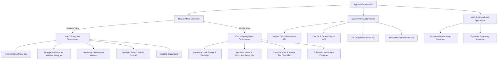

<div align="center">

#  macOS Sequoia & iOS 18 Hybrid Portfolio OS

<p align="center">
  <b>A high-fidelity, interactive desktop & mobile operating system simulator built with React 19, TypeScript, and Tailwind CSS v4.</b>
</p>

[](https://hybrid-os.vercel.app/)
[](https://react.dev/)
[](https://www.typescriptlang.org/)
[](https://tailwindcss.com/)
[](https://vite.dev/)
[](https://www.framer.com/motion/)
[](LICENSE)

[🌐 **Live Demo**](https://hybrid-os.vercel.app/) &nbsp;|&nbsp; [💻 **Author Portfolio**](https://santhoshh.xyz/) &nbsp;|&nbsp; [📫 **Contact Author**](mailto:heysanthoshreddy@gmail.com)

---

</div>

## 📌 Table of Contents

- [Executive Overview](#-executive-overview)
- [System Architecture](#-system-architecture)
- [Key Features & Experience Modes](#-key-features--experience-modes)
  - [macOS Sequoia Desktop Mode](#-macos-sequoia-desktop-mode)
  - [iOS 18 Mobile Mode (SpringBoard)](#-ios-18-mobile-mode-springboard)
- [Simulated Native Applications](#-simulated-native-applications)
- [Real-Time Telemetry & Web Audio Engine](#-real-time-telemetry--web-audio-engine)
- [Tech Stack Architecture](#-tech-stack-architecture)
- [Directory Structure](#-directory-structure)
- [Getting Started & Local Setup](#-getting-started--local-setup)
- [Available NPM Scripts](#-available-npm-scripts)
- [Live Telemetry & API Configuration](#-live-telemetry--api-configuration)
- [Featured Portfolio Index](#-featured-portfolio-index)
- [Engineering Standards & Best Practices](#-engineering-standards--best-practices)
- [Contributing](#-contributing)
- [License](#-license)
- [Author & Contact](#-author--contact)

---

## 📌 Executive Overview

**macOS Sequoia & iOS 18 Hybrid Portfolio OS** is an interactive web-based operating system simulator designed to showcase developer portfolio projects, technical expertise, and career history within Apple's modern design ecosystem.

Engineered with **React 19**, **TypeScript 6**, **Tailwind CSS v4**, and **Framer Motion 12**, the platform delivers dual-mode simulation across desktop (**macOS Sequoia**) and mobile (**iOS 18 SpringBoard**) environments. Key technical capabilities include:

- **Window Management System:** Multi-window drag-and-drop, dynamic z-index depth layering, boundary constraints, and window traffic-light controls (`minimize`, `maximize`, `close`).
- **Real-Time Data Pipelines:** Asynchronous telemetry polling for Discord presence (Lanyard), live music activity (Last.fm & iTunes Search API), movie metadata (TMDb), and orbital astronaut tracking (ISS People in Space API).
- **Native Audio Synthesizer:** Browser-native procedural ambient audio synthesizer powered by the **Web Audio API**.
- **Dynamic iOS 18 Customization:** Real-time SpringBoard icon tinting (Light, Dark, Tinted) with dynamic accent color matrix selections.

---

## 🏗 System Architecture

The project relies on a modular component hierarchy that cleanly segregates OS mode orchestration, live telemetry fetching, procedural audio synthesis, and visual rendering components.



---

## ✨ Key Features & Experience Modes

### 💻 macOS Sequoia Desktop Mode

- **Translucent Top Menu Bar:** Frosted glass header featuring responsive system menus, real-time clock, status indicators, and control toggles.
- **Window Management System:** Smooth window dragging, boundary checking, z-index stack focusing, and window traffic control actions (`minimize`, `maximize`, `close`).
- **3D Desktop Widgets:** Floating widgets featuring live location weather, interactive calendar grid, analog clock, device battery telemetry, and orbital space tracking.
- **Spotlight Launcher (`Cmd/Ctrl + K`):** System-wide search modal with keyboard navigation to launch apps, filter skills, and query project repositories.
- **Interactive Glass Dock:** Dynamic magnification dock supporting application state indicators and quick launches.

### 📱 iOS 18 Mobile Mode (SpringBoard)

- **Interactive Lock Screen:** Native-style Lock Screen with ambient light cone controls for **Flashlight** and instant camera activation.
- **Dynamic Island Status Bar:** Morphing capsule pill that expands during music playback, volume shifts, and brightness adjustments with animated frequency equalizer bars.
- **Control Center Panel:** Gesture-responsive vertical sliders for volume and display brightness alongside network connectivity toggles.
- **Icon Appearance Tinting:** Real-time home screen icon customization supporting **Light**, **Dark**, and **Tinted** modes with 5 curated iOS accent color presets.

---

## 📱 Simulated Native Applications

The operating system includes a suite of built-in applications mirroring Apple's core UI design language:

| Application | Icon | Description & Key Features |
| :--- | :---: | :--- |
| **Settings** | ⚙️ | System settings hierarchy, iCloud profile card, category groups, and appearance controls. |
| **Messages** | 💬 | iMessage thread simulator featuring custom speech bubbles and interactive developer dialogue. |
| **Safari** | 🧩 | Browser capsule with address bar controls, bookmark shortcuts, and portfolio project indexing. |
| **Spotify & VLC** | 🎵 | Animated vinyl turntable, music metadata visualization, album art background lighting, and procedural Web Audio synth. |
| **Notes** | 📝 | Multi-folder developer notebook detailing technical skills, career timeline, and project architecture. |
| **Photos** | 🖼️ | Grid catalog of project showcases with scale transitions and full-screen lightbox previewer. |
| **Finder** | 📁 | Translucent sidebar file manager with tagged folders, breadcrumb navigation, and project summaries. |
| **VS Code & Discord** | 💻 | Embedded code viewer and real-time Discord activity presence stream via the Lanyard API. |

---

## ⚡ Real-Time Telemetry & Web Audio Engine

1. **Web Audio Ambient Synthesizer:**
   Generates browser-native procedural ambient chords using oscillators and gain nodes without relying on heavy external audio files.

2. **Discord Lanyard API Integration:**
   Streams live status, custom Discord activities (VS Code, Spotify, active gaming sessions), and bio metadata in real-time over WebSocket/REST protocols.

3. **Last.fm & iTunes Search API:**
   Polls recent music scrobbles and queries the iTunes Search API to dynamically render high-resolution 600x600px album artwork.

4. **ISS Orbital Space Telemetry:**
   Fetches live headcount data of astronauts currently aboard the International Space Station via the People in Space API.

---

## 🛠 Tech Stack Architecture

| Category | Technology | Version | Purpose |
| :--- | :--- | :---: | :--- |
| **Core UI Framework** | [React](https://react.dev/) | `19.2` | Component architecture & reactive state management |
| **Type System** | [TypeScript](https://www.typescriptlang.org/) | `6.0` | End-to-end type safety & interface validation |
| **Styling Engine** | [Tailwind CSS](https://tailwindcss.com/) | `4.3` | Modern CSS-first utility classes, tokens, & glassmorphism |
| **Animation Engine** | [Framer Motion](https://www.framer.com/motion/) | `12.4` | Drag physics, SpringBoard gestures, & UI micro-interactions |
| **Build System** | [Vite](https://vite.dev/) | `8.1` | Instant HMR development server & production bundler |
| **Iconography** | [Lucide React](https://lucide.dev/) | `0.475` | Vector icon system |
| **Linter** | [oxlint](https://oxc.rs/) | `1.71` | High-speed Rust-powered JavaScript/TypeScript linter |
| **Audio Engine** | Web Audio API | Native | Procedural sound generation & audio visualization |

---

## 📂 Directory Structure

```
macos-portfolio/
├── public/                     # Static assets, favicons, and social images
├── src/
│   ├── assets/                 # SVGs, wallpaper backdrops, and media resources
│   ├── components/
│   │   ├── desktop/            # macOS Sequoia Desktop Components
│   │   │   ├── DesktopWidgets.tsx   # Live weather, calendar, clock, battery, & ISS widgets
│   │   │   ├── Dock.tsx             # Magnifying desktop Dock launcher
│   │   │   ├── LockScreen.tsx       # Desktop lock screen overlay
│   │   │   ├── MenuBar.tsx          # Frosted glass top menu navigation bar
│   │   │   ├── Spotlight.tsx        # Cmd+K system search palette modal
│   │   │   └── Window.tsx           # Draggable, resizable window container
│   │   ├── mobile/             # iOS 18 Mobile Components
│   │   │   ├── AppView.tsx          # Fullscreen mobile application window
│   │   │   ├── Springboard.tsx      # iOS home screen grid & Control Center
│   │   │   └── StatusBar.tsx        # Dynamic Island status bar & audio capsule
│   │   ├── shared/             # Cross-Platform Views & Data Maps
│   │   │   ├── SectionContent.tsx   # Application view router (Settings, Messages, Safari, etc.)
│   │   │   ├── sectionsData.ts      # Portfolio project profiles, skills, & timeline data
│   │   │   └── tokens.ts            # Design tokens & iOS accent color presets
│   │   └── ui/                 # Reusable low-level UI primitives
│   ├── hooks/
│   │   └── useLiveAPI.ts       # Telemetry custom hook (Lanyard, Last.fm, iTunes, ISS)
│   ├── App.css                 # Glassmorphism utilities & CSS animation keyframes
│   ├── App.tsx                 # Root application orchestration & layout router
│   ├── index.css               # Tailwind CSS v4 directives & theme variables
│   └── main.tsx                # Application root entry point
├── developer_details.txt       # Technical portfolio source data & API specifications
├── package.json                # Project dependencies and script runner configurations
├── tsconfig.json               # TypeScript compiler options
└── vite.config.ts              # Vite build setup and plugin configurations
```

---

## 🚀 Getting Started & Local Setup

### Prerequisites

Verify that your system meets the minimum requirements:

- **Node.js**: `v18.0.0` or higher
- **npm**: `v9.0.0` or higher (or `pnpm` / `yarn` / `bun`)

### Quick Start Installation

1. **Clone the repository:**
   ```bash
   git clone https://github.com/santjsx/mac_portfolio.git
   cd mac_portfolio
   ```

2. **Install project dependencies:**
   ```bash
   npm install
   ```

3. **Launch the development server:**
   ```bash
   npm run dev
   ```
   Open your browser and navigate to `http://localhost:5173`.

4. **Compile for production:**
   ```bash
   npm run build
   ```

5. **Preview production build locally:**
   ```bash
   npm run preview
   ```

---

## 📜 Available NPM Scripts

| Command | Action |
| :--- | :--- |
| `npm run dev` | Starts the Vite development server with instant HMR. |
| `npm run build` | Executes TypeScript type checking (`tsc -b`) and builds production assets to `/dist`. |
| `npm run lint` | Runs `oxlint` for static code quality analysis. |
| `npm run preview` | Serves the production build locally for verification. |

---

## ⚙️ Live Telemetry & API Configuration

To connect your own social handles and telemetry sources, configure the constants in [`src/hooks/useLiveAPI.ts`](file:///c:/Users/heysa/Documents/Dev/macos%20portfolio/src/hooks/useLiveAPI.ts):

```typescript
// Discord Lanyard Integration
const LANYARD_DISCORD_ID = "YOUR_DISCORD_USER_ID"; // Default: 1284925883240550552

// Last.fm Music Activity Tracking
const LASTFM_USER = "YOUR_LASTFM_USERNAME";       // Default: santhoshh25
const LASTFM_API_KEY = "YOUR_LASTFM_API_KEY";     // Replace with your API key

// TMDb Movie & TV Metadata
const TMDB_API_KEY = "YOUR_TMDB_API_KEY";         // Replace with your TMDb key
```

---

## 💼 Featured Portfolio Index

Here are key projects created by **Santhosh Reddy** featured within the operating system:

| Project Name | Live URL | Description |
| :--- | :---: | :--- |
| **The Hustle Planner** | [View App](https://the-hustle-planner.vercel.app/) | High-performance productivity engine featuring deep work timers, habit loops, and spatial calendar layouts. |
| **Hybrid OS** | [View App](https://hybrid-os.vercel.app/) | Web-based operating system simulator built with React 19, TypeScript, and Tailwind CSS v4. |
| **PDF Studio** | [View App](https://pdf-studio-sable.vercel.app/) | Powerful client-side PDF editing suite for secure annotations, page extraction, and digital signatures. |
| **Track A Lot** | [View App](https://track-a-lot.vercel.app/) | Intelligent personal finance tracker with automated expense categorization and interactive analytics. |
| **Uno Cypher** | [View App](https://uno-cypher.vercel.app/) | Zero-dependency encryption panel utilizing AES-GCM web standards for client-side message security. |

---

## 🛠 Engineering Standards & Best Practices

- **Zero-State Bloat Architecture:** Uses localized React state and lightweight custom hooks (`useLiveAPI`) to prevent unneeded re-renders.
- **Glassmorphic Aesthetic System:** Implements CSS `backdrop-filter: blur()`, subtle border highlights, and color tokens tailored for dark/light themes.
- **High-Performance Motion:** Framer Motion spring physics optimize drag, resize, and window transitions without layout thrashing.
- **Accessible & Responsive:** Adapts dynamically to screen size with fallback controls for touch screens and mobile viewports.

---

## 🤝 Contributing

Contributions, issues, and feature suggestions are welcome!

1. Fork the repository (`https://github.com/santjsx/mac_portfolio/fork`).
2. Create a feature branch (`git checkout -b feature/amazing-feature`).
3. Commit your changes (`git commit -m 'feat: add amazing feature'`).
4. Push to the branch (`git push origin feature/amazing-feature`).
5. Open a Pull Request.

---

## 📄 License

Distributed under the **MIT License**. See [`LICENSE`](LICENSE) for details.

---

## 👨‍💻 Author & Contact

**Santhosh Reddy** (*@santjsx*)
- 🌐 **Portfolio Website:** [santhoshh.xyz](https://santhoshh.xyz/)
- 💻 **Live OS Application:** [hybrid-os.vercel.app](https://hybrid-os.vercel.app/)
- 🐙 **GitHub:** [@santjsx](https://github.com/santjsx)
- 🐦 **X / Twitter:** [@Santhoshh_void](https://x.com/Santhoshh_void)
- 📸 **Instagram:** [@whoissanthoshh](https://www.instagram.com/whoissanthoshh)
- ✉️ **Email:** [heysanthoshreddy@gmail.com](mailto:heysanthoshreddy@gmail.com)

<div align="center">
  <br />
  <sub>Designed & Developed with precision by Santhosh Reddy. Powered by React 19 & Tailwind CSS.</sub>
</div>